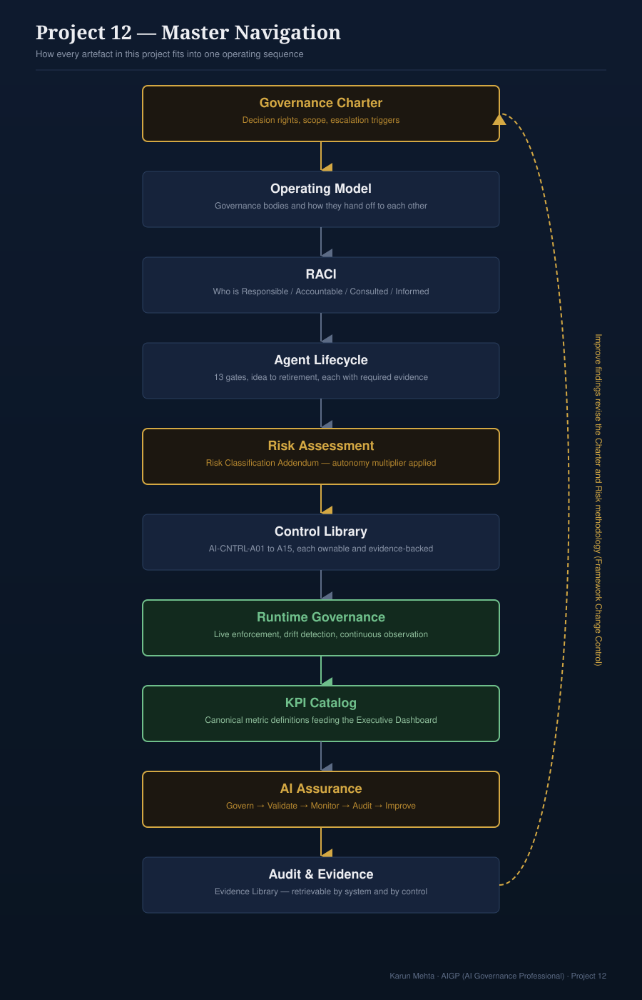

## Project 12: Agentic AI Governance Toolkit

**Project 12 of the AI Governance Portfolio**
**Author:** Karun Mehta · AIGP (AI Governance Professional)
**Version:** 2 (Enterprise, Audit-Ready, Adoption-Ready)

> ⚠️ **Disclaimer:** This project is a fictional illustrative exercise built for portfolio and educational purposes. All organisations, systems, incidents, and named individuals are invented. No real entity, product, or event is depicted. Nothing in this project constitutes legal advice.

*How every artefact in this project fits into one operating sequence — full diagram: [`master-navigation-diagram.svg`](./11-architecture/master-navigation-diagram.svg)*

### Where This Project Sits in the Portfolio

Projects 1–5 are narrative — one fictional organisation, specific dated incidents, connected reasoning across projects. Projects 6–11 deliberately step outside that narrative to be generic, industry-agnostic, reusable toolkits. Project 12 follows the Projects 6–11 model: it's a fully reusable, industry-agnostic **toolkit** for governing autonomous, tool-using agentic AI — a governance charter, a 16-control library, a compliance crosswalk, layer-specific governance instruments (identity, MCP, memory, prompts, models, data, vendors), fillable templates, and completed worked examples. The applied, narrative case studies that use this toolkit live in **[Project 13: Enterprise AI Governance Case Studies](../project-13-enterprise-ai-governance-case-studies/)**, so that all of this portfolio's applied narratives sit in one place regardless of whether the system involved is agentic or not.

### Repository Structure

| Folder | Contents |
|---|---|
| `01-governance-charter/` | Principles, scope, decision rights |
| `02-operating-model/` | Committees, roles, responsibilities |
| `03-agent-lifecycle/` | End-to-end lifecycle & gates |
| `04-risk-framework/` | Risk classification & methodology |
| `05-control-library/` | Enterprise AI control catalog |
| `06-runtime-governance/` | Runtime monitoring & oversight |
| `07-ai-assurance/` | Continuous assurance framework |
| `08-templates/` | Ready-to-use governance templates |
| `09-examples/` | Completed example documents |
| `11-architecture/` | Reference architecture diagrams |
| `12-implementation-guide/` | 5-week implementation roadmap |

### Why This Project Exists

Projects 1–11 establish enterprise AI governance for predictive and generative AI systems — models, classifiers, and the decisions they output. Project 12 extends that operating model to autonomous, tool-using agentic AI, introducing the governance mechanisms required for systems that plan, decide, and execute actions with limited human intervention: an agent doesn't just produce an output for a human to act on, it takes the action itself, often through several tool calls and intermediate decisions a human never sees.

This project asks the question most 2026 governance programmes are currently getting wrong: **do you extend your existing AI governance policy to cover agents, or do you need a distinct governance layer for them?** The answer this project builds toward is: extend the regulatory scaffolding (EU AI Act, NIST AI RMF, ISO/IEC 42001), but add the agent-specific instruments that scaffolding doesn't natively provide — because none of it was written with autonomous, multi-step, tool-using systems in mind.

### What You'll Find — Start Here

If you have five minutes, read these four in order: Charter → Control Library → Compliance Crosswalk → Executive Dashboard. For applied worked examples of this toolkit in use, go to [Project 13](../project-13-enterprise-ai-governance-case-studies/).

| Area | Purpose | Start With |
|---|---|---|
| Governance Charter | Decision rights and governance principles | [`agentic-ai-system-charter.md`](./01-governance-charter/agentic-ai-system-charter.md) |
| Operating Model | Governance bodies and responsibilities | [`ai-governance-operating-model.md`](./02-operating-model/ai-governance-operating-model.md) |
| Risk Framework | Classification and risk methodology | [`agentic-risk-classification-addendum.md`](./04-risk-framework/agentic-risk-classification-addendum.md) |
| Control Library | Enterprise AI controls | [`agentic-control-library.md`](./05-control-library/agentic-control-library.md) |
| Runtime Governance | Production monitoring and enforcement | [`runtime-governance.md`](./06-runtime-governance/runtime-governance.md) |
| Assurance Framework | Continuous governance lifecycle | [`ai-assurance-framework.md`](./07-ai-assurance/ai-assurance-framework.md) |
| Governance Automation | Automated vs. human controls | [`governance-automation.md`](./12-implementation-guide/governance-automation.md) |
| Case Studies | Worked examples applying this toolkit | [Project 13: Enterprise AI Governance Case Studies](../project-13-enterprise-ai-governance-case-studies/) |
| How to Implement | 5-week starting path for adopting this framework | [`how-to-implement.md`](./12-implementation-guide/how-to-implement.md) |
| Templates | Fillable forms — risk assessment, exceptions, vendor review, incidents | [`08-templates/`](./08-templates/) |
| Completed Examples | Every template filled out against a real (fictional) scenario | [`09-examples/`](./09-examples/) |
| License & Reuse | What you can do with this content | [`license-and-reuse.md`](./license-and-reuse.md) |
| Master Navigation | One diagram showing how every artefact connects | [`master-navigation-diagram.svg`](./11-architecture/master-navigation-diagram.svg) |

### What's In This Project

**Core governance**
| Artefact | Purpose |
|---|---|
| `agentic-ai-system-charter.md` | Scope, decision rights (direct / advisory / delegated), committee structure, escalation triggers |
| `agent-policy.md` | Identity & permissions, least-privilege scoping, human checkpoints, action traceability, runtime enforcement |
| `agentic-risk-classification-addendum.md` | Extends Project 9's risk methodology with an autonomy multiplier; engages the live high-risk-by-default debate |
| `human-oversight-framework.md` | Three oversight postures (in-loop / on-loop / over-loop) mapped to required autonomy levels |
| `agent-lifecycle.md` | Twelve-stage gate sequence, idea to retirement, with the evidence each stage produces |

**Inventory, identity & control**
| Artefact | Purpose |
|---|---|
| `agent-inventory-register.md` + `.csv` | The CMDB for agents — autonomy level, tool/credential scope, kill-switch status |
| `agent-identity-governance.md` | Non-human identity: scoped credentials, vault, rotation, revocation independent of the agent |
| `agentic-control-library.md` | Sixteen numbered, categorized, ownable, evidence-backed controls (`AI-CNTRL-A01`–`A16`) across 10 control categories |
| `05-control-library/agentic-compliance-crosswalk.md` | Maps controls to NIST AI RMF, EU AI Act, ISO/IEC 42001, OWASP LLM Top 10, MITRE ATLAS, AIUC-1, GDPR, and SOC 2/NIST 800-53 |
| `agentic-ai-governance-raci.md` | Responsible/Accountable/Consulted/Informed across every activity in this project |

**Layer-specific governance**
| Artefact | Purpose |
|---|---|
| `runtime-governance.md` | Live policy engine decisions, drift, hallucination rate, override rate, cost, latency |
| `mcp-governance.md` | Approved/blocked MCP servers, tool registry, trust boundaries, signing |
| `memory-governance.md` | Session vs. persistent memory, classification-at-write, deletion, poisoning detection |
| `prompt-governance.md` | Prompt registry, versioning, approval, drift detection, injection-resistance |
| `model-governance.md` | Model approval, version pinning, upgrade evaluation, rollback |
| `data-governance.md` | Classification, masking in logs, retention, residency, lineage across the agent pipeline |
| `third-party-ai-governance.md` | Vendor assessment: retraining rights, residency, DPAs, subprocessors, kill-switch independence |

**Operating model & metrics**
| Artefact | Purpose |
|---|---|
| `ai-governance-operating-model.md` | The governance bodies (Committee, Architecture Review Board, Risk Committee, Audit, etc.), what each is for, and the handoff chain between them |
| `ai-governance-kpi-catalog.md` | Canonical KPI definitions (Risk, Operations, Quality, Governance, Financial, Vendor) — Runtime Governance and the Dashboard reference this rather than each maintaining their own list |
| `exception-management.md` | The sanctioned path for a time-bound, reviewed deviation from a control, with mandatory compensating controls and expiration |
| `ai-governance-roadmap.md` | Maturity-sequenced build order (Inventory → Policy → Risk → Controls → Runtime → Automation → Continuous Assurance), mapped to the Assurance Framework's five levels |
| `governance-automation.md` | Which controls can run on GitHub Actions/OPA/SIEM tooling without losing judgment, and which can't be automated at all |
| `ai-governance-decision-tree.svg`/`.png` | Intake flowchart: is this AI → what kind → autonomy multiplier → decision rights |

**Operating the framework**
| Artefact | Purpose |
|---|---|
| `ai-incident-response-playbook.md` | Detection → containment → kill switch → investigation → executive report, sequenced for agents that can act before detection catches up |
| `ai-assurance-framework.md` | Govern → Validate → Monitor → Audit → Improve cycle, plus a five-level maturity self-assessment |
| `evidence-library.md` | Index of what evidence exists, where, and which control or lifecycle stage it satisfies |
| `framework-change-control.md` | Version control and change management for this governance framework itself |

**Visuals**
| Artefact | Purpose |
|---|---|
| `master-navigation-diagram.svg`/`.png` | The single sequence — Charter → Operating Model → RACI → Lifecycle → Risk → Controls → Runtime → KPIs → Assurance → Audit — with the Improve feedback loop shown explicitly |
| `agentic-governance-architecture.svg`/`.png` | Reference pipeline, checkpoint, and decision-rights split — see Project 13 for the full applied narrative |
| `agent-governance-dashboard-v2.svg`/`.png` | Expanded executive KPI dashboard (inventory, risk, cost, vendors, trend) |
| `enterprise-architecture.svg`/`.png` | Full layered stack, Business through Audit, each layer mapped to its governing artefact |
| `agent-governance-dashboard.svg`/`.png` | Earlier v1 dashboard, kept for the version history this project's own Change Control document argues for |

**Templates** (`08-templates/` folder — see [`how-to-implement.md`](./12-implementation-guide/how-to-implement.md) for how to sequence using them)
| Artefact | Purpose |
|---|---|
| `08-templates/risk-assessment-template.md` | Fillable risk scoring form implementing the Risk Classification Addendum |
| `08-templates/pre-deployment-review-record.md` | Fillable go/no-go decision record for Lifecycle Stage 7 (Human Approval) — checks scaled to autonomy level, findings table, decision, sign-off |
| `08-templates/exception-request-form.md` | Fillable form implementing Exception Management |
| `08-templates/vendor-assessment-form.md` | Fillable scoring form implementing Third-Party AI Governance |
| `08-templates/agent-inventory-entry-template.md` | Fillable single-agent entry matching the Inventory Register schema |
| `08-templates/incident-report-template.md` | Fillable form implementing the Incident Response Playbook |
| `08-templates/runtime-review-checklist.md` | Fillable periodic review checklist tied to the KPI Catalog |
| `08-templates/governance-committee-agenda.md` | Standing-items agenda template for the AI Governance Committee |
| `08-templates/control-implementation-tracker.md` | Per-control status tracker (16 controls) with roll-up completeness percentage |

**Examples** (`09-examples/` folder — completed instances of the templates above)
| Artefact | Purpose |
|---|---|
| `09-examples/completed-risk-assessment-example.md` | `ORG-AI-011`'s actual risk assessment, autonomy multiplier applied |
| `09-examples/completed-pre-deployment-review-example.md` | `ORG-AI-013`'s Stage 7 review — Critical findings on launch, remediation plan, Conditional Go |
| `09-examples/completed-vendor-assessment-example.md` | The foundation model provider's scored vendor assessment |
| `09-examples/completed-incident-report-example.md` | The full incident narrated in Project 13's case studies |
| `09-examples/completed-runtime-review-example.md` | The recovery-period review following that incident |
| `09-examples/completed-exception-request-example.md` | A time-bound kill-switch testing exception during a platform migration |

### How This Connects to the Rest of the Portfolio

Uses the same fictional organisation and `ORG-AI-0XX` numbering as Projects 1–5. Extends Project 9's risk register, Project 6's committee structure, and Project 11's principle of connecting governance to actual tooling — applied here to agent runtime and MCP tooling rather than only eval tooling. Applied narratives built on this toolkit live in Project 13 alongside this portfolio's other case studies.

### What This Project Is Designed to Demonstrate

- That agentic AI governance requires instruments model governance never needed: non-human identity, runtime policy enforcement, MCP-layer trust boundaries, memory-specific controls
- Fluency with the current, unsettled state of the field, including where regulators and standards bodies currently disagree
- Governance as an operating model — lifecycle gates, ownership, controls, evidence, and a feedback loop — not a static policy document set

---

**Author:** Karun Mehta · AIGP (AI Governance Professional)
